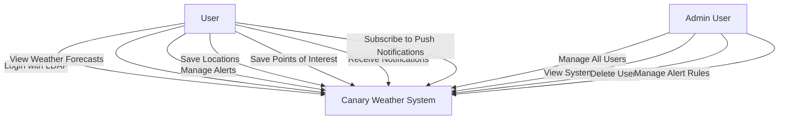
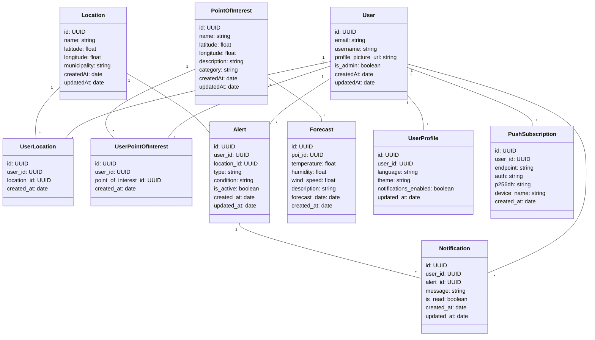
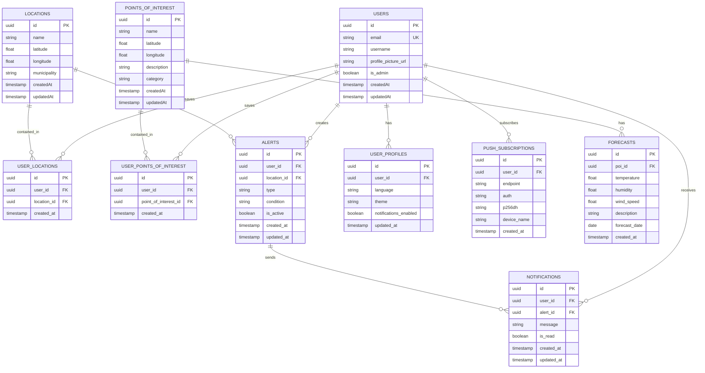
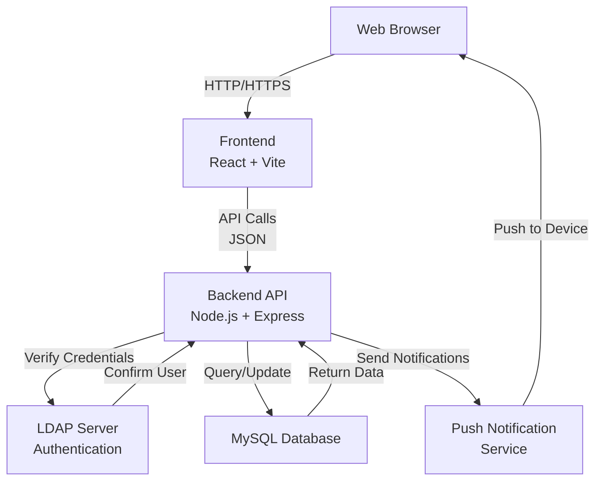
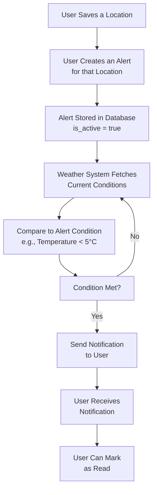
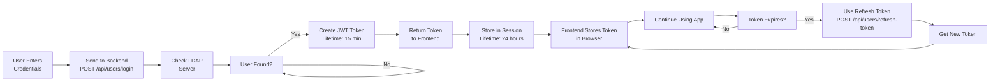
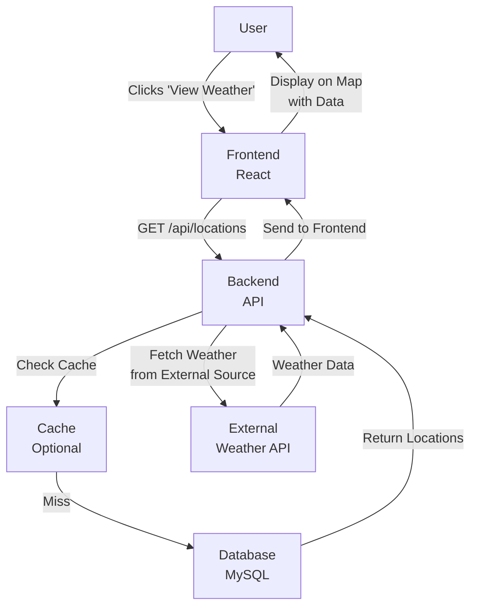

# CanaryWeather System Diagrams

This document provides visual representations of the Canary Weather application system. All diagrams use Mermaid format to show use cases, class structures, and database relationships.

---

## 1. Use Case Diagram

This diagram shows what different users can do in the Canary Weather system.

### Use Case Description

- **Login**: Users authenticate using LDAP credentials (username and password).
- **View Weather Forecasts**: Users can see current and future weather information for locations and points of interest.
- **Manage Alerts**: Users create, update, or delete weather alerts based on their saved locations.
- **Save Locations**: Users can save cities or geographic areas they want to monitor.
- **Save Points of Interest**: Users can save specific locations like parks, beaches, or landmarks.
- **Receive Notifications**: When alerts are triggered, users receive notifications through the app.
- **Subscribe to Push Notifications**: Users can receive push notifications on their devices.
- **Admin Functions**: Administrators have additional permissions to manage the entire system.

---

## 2. Class Diagram

This diagram shows the main classes (models) in the backend and their relationships.

### Class Descriptions

- **User**: Represents a person who uses the application. Stores authentication info and profile data.
- **Location**: A geographic area like a city or municipality that users want to monitor.
- **PointOfInterest**: A specific location like a beach, park, or landmark.
- **UserLocation**: Links users to their saved locations (many-to-many relationship).
- **UserPointOfInterest**: Links users to their saved points of interest (many-to-many relationship).
- **Alert**: A notification rule set by a user for a specific location (e.g., alert if temperature drops below 5°C).
- **Notification**: A message sent to a user when their alert conditions are met.
- **Forecast**: Weather prediction data for a specific point of interest.
- **UserProfile**: User preferences and settings (language, theme, notification settings).
- **PushSubscription**: Information needed to send push notifications to a user's device.

---

## 3. Entity-Relationship Diagram (ERD)

This diagram shows how database tables relate to each other.

### Entity Descriptions

- **USERS**: Core table storing user account information and admin status.
- **LOCATIONS**: Geographic areas (cities, regions) that users follow.
- **POINTS_OF_INTEREST**: Specific landmarks, beaches, parks, or notable places.
- **USER_LOCATIONS**: Junction table connecting users to locations they follow.
- **USER_POINTS_OF_INTEREST**: Junction table connecting users to points of interest they follow.
- **ALERTS**: Rules that trigger notifications based on weather conditions.
- **NOTIFICATIONS**: Messages sent to users when alerts are triggered.
- **FORECASTS**: Weather prediction data linked to points of interest.
- **USER_PROFILES**: Settings and preferences for each user.
- **PUSH_SUBSCRIPTIONS**: Device information for sending push notifications.

---

## 4. System Architecture Diagram

This diagram shows how the frontend, backend, and database communicate.

### Flow Explanation

1. **User Opens Browser**: Connects to the React frontend application.
2. **User Logs In**: Credentials are sent to the backend API.
3. **API Verifies**: Checks username and password against LDAP server.
4. **JWT Token Issued**: If login succeeds, user gets a JWT token for future requests.
5. **User Actions**: Frontend sends API requests with the JWT token.
6. **API Processes**: Backend queries the MySQL database and performs actions.
7. **Notifications**: When alerts trigger, notifications are sent to user devices via push service.

---

## 5. Alert Workflow Diagram

This diagram shows how alerts are created and triggered.

---

## 6. Authentication Flow Diagram

This diagram shows how users log in and stay authenticated.

### Token Details

- **JWT Token**: Valid for 15 minutes. Required for all API requests.
- **Session Cookie**: Stored on server. Valid for 24 hours.
- **Refresh Token**: Used to get a new JWT token when the current one expires.
- **Token Storage**: Frontend stores the JWT token in browser memory (not localStorage for security).

---

## 7. Data Flow Diagram

This diagram shows how data moves through the system when a user views weather information.

---

## Summary

These diagrams provide a complete visual overview of:

- **What users do** (Use Case Diagram)
- **What classes exist** (Class Diagram)
- **How data is stored** (Entity-Relationship Diagram)
- **How components interact** (System Architecture)
- **How alerts work** (Alert Workflow)
- **How authentication works** (Authentication Flow)
- **How data moves** (Data Flow)

For more detailed information about specific areas, refer to other documentation files:
- `ARCHITECTURE.md` for system design
- `DATABASE.md` for database schema
- `AUTHENTICATION.md` for login details