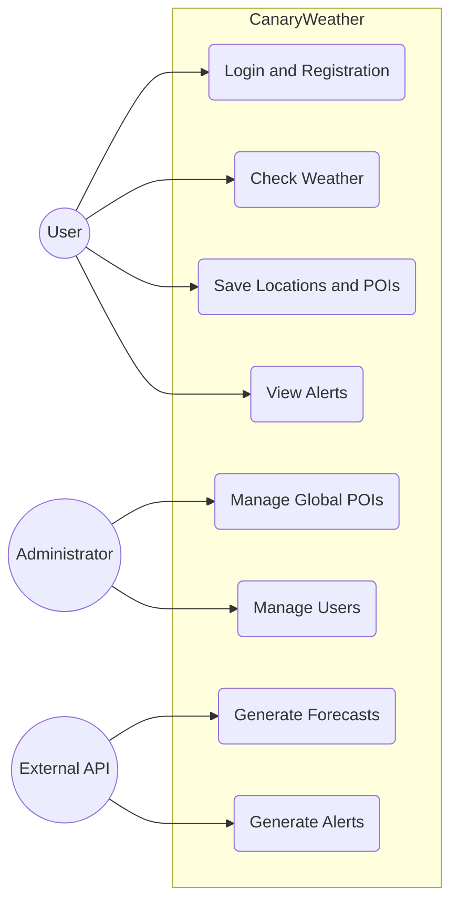
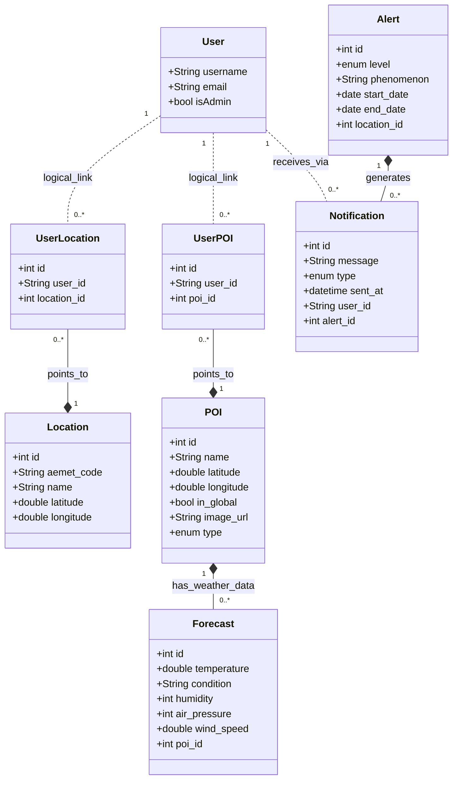
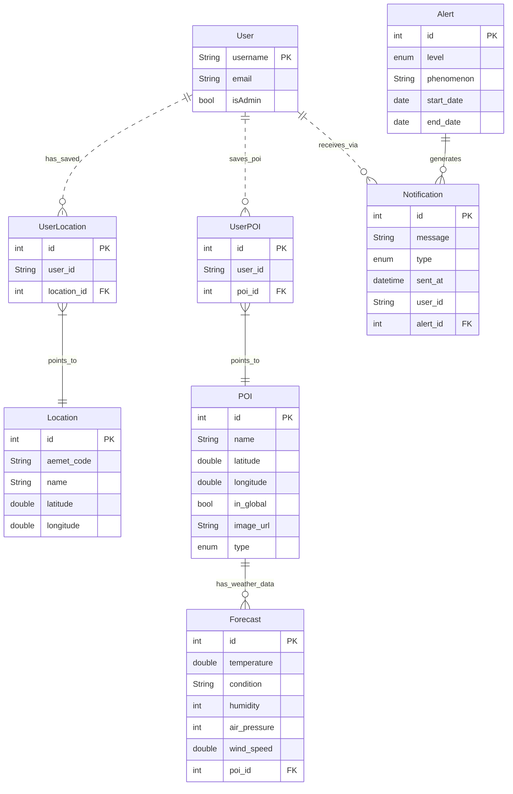

# CanaryWeather Diagrams Documentation

This document contains various diagrams that visualize the structure and relationships within the CanaryWeather application.

---

## Use Case Diagram

## Class Diagram

## Entity Relationship Diagram

