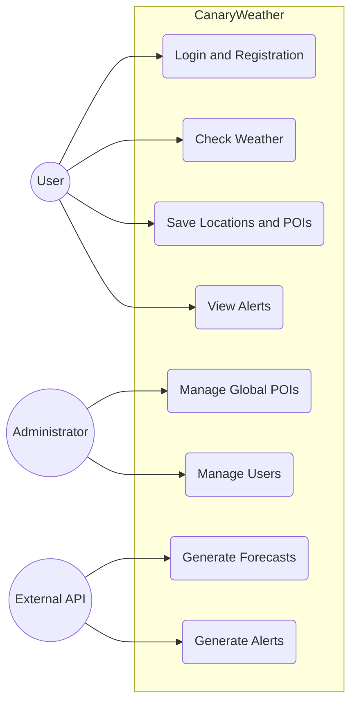
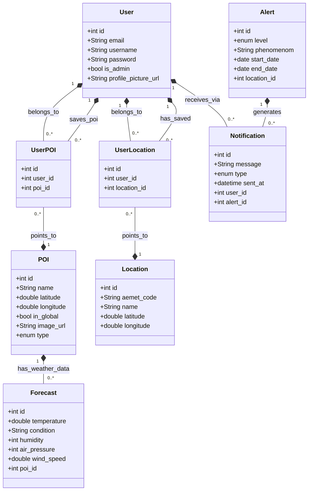
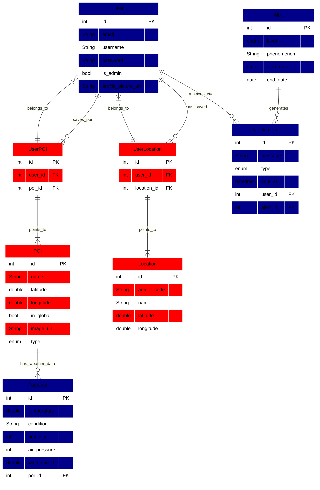

# Diagrams

## Use case diagram

```mermaid
graph LR
    User((User))
    Admin((Administrator))
    API((External API))

    subgraph CanaryWeather
        UC1(Login and Registration)
        UC2(Check Weather)
        UC3(Save Locations and POIs)
        UC4(View Alerts)
        UC5(Manage Global POIs)
        UC6(Manage Users)
        UC7(Generate Forecasts)
        UC8(Generate Alerts)
    end

    User --> UC1
    User --> UC2
    User --> UC3
    User --> UC4

    Admin --> UC5
    Admin --> UC6

    API --> UC7
    API --> UC8
```

## Class diagram

```mermaid
classDiagram
    class User {
        +int id
        +String email
        +String username
        +String password
        +bool is_admin
        +String profile_picture_url
    }
    
    class POI {
        +int id
        +String name
        +double latitude
        +double longitude
        +bool in_global
        +String image_url
        +enum type
    }

    class Location {
        +int id
        +String aemet_code
        +String name
        +double latitude
        +double longitude
    }

    class Forecast {
        +int id
        +double temperature
        +String condition
        +int humidity
        +int air_pressure
        +double wind_speed
        +int poi_id
    }
    
    class Alert {
        +int id
        +enum level
        +String phenomenom
        +date start_date
        +date end_date
        +int location_id
    }

    class UserLocation {
        +int id
        +int user_id
        +int location_id
    }
    
    class UserPOI {
        +int id
        +int user_id
        +int poi_id
    }
    
    class Notification {
        +int id
        +String message
        +enum type
        +datetime sent_at
        +int user_id
        +int alert_id
    }
    
    User "1" *-- "0..*" UserLocation : has_saved
    User "1" *-- "0..*" UserPOI : saves_poi
    
    POI "1" *-- "0..*" Forecast : has_weather_data 
    
    UserLocation "0..*" --* "1" User : belongs_to
    UserLocation "0..*" --* "1" Location : points_to

    UserPOI "0..*" --* "1" User : belongs_to
    UserPOI "0..*" --* "1" POI : points_to
    
    Alert "1" *-- "0..*" Notification : generates
    User "1" *-- "0..*" Notification : receives_via
```

## Entity relationship diagram

```mermaid
erDiagram
    User ||--o{ UserLocation : has_saved
    User ||--o{ UserPOI : saves_poi
    
    POI ||--o{ Forecast : has_weather_data 
    
    UserLocation ||--|{ User : belongs_to
    UserLocation ||--|{ Location : points_to

    UserPOI ||--|{ User : belongs_to
    UserPOI ||--|{ POI : points_to
    
    Alert ||--o{ Notification : generates
    User ||--o{ Notification : receives_via
    
    User {
        int id PK
        String email
        String username
        String password
        bool is_admin
        String profile_picture_url
    }
    
    POI {
        int id PK
        String name
        double latitude
        double longitude
        bool in_global
        String image_url
        enum type
    }

    Location {
        int id PK
        String aemet_code
        String name
        double latitude
        double longitude
    }

    Forecast {
        int id PK
        double temperature
        String condition
        int humidity
        int air_pressure
        double wind_speed
        int poi_id FK
    }
    
    Alert {
        int id PK
        enum level
        String phenomenom
        date start_date
        date end_date
    }

    UserLocation {
        int id PK
        int user_id FK
        int location_id FK
    }
    
    UserPOI {
        int id PK
        int user_id FK
        int poi_id FK
    }
    
    Notification {
        int id PK
        String message
        enum type
        datetime sent_at
        int user_id FK
        int alert_id FK
    }

style User fill:#00008B,stroke:#fff,color:#000000
style UserPOI fill:#FF0000,stroke:#fff,color:#000000
style UserLocation fill:#FF0000,stroke:#fff,color:#000000
style POI fill:#FF0000,stroke:#fff,color:#000000
style Location fill:#FF0000,stroke:#fff,color:#000000
style Forecast fill:#00008B,stroke:#fff,color:#000000
style Alert fill:#00008B,stroke:#fff,color:#000000
style Notification fill:#00008B,stroke:#fff,color:#000000
```

**Gabriel** -> Red
**Angelo** -> Blue