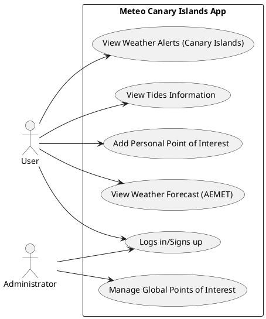
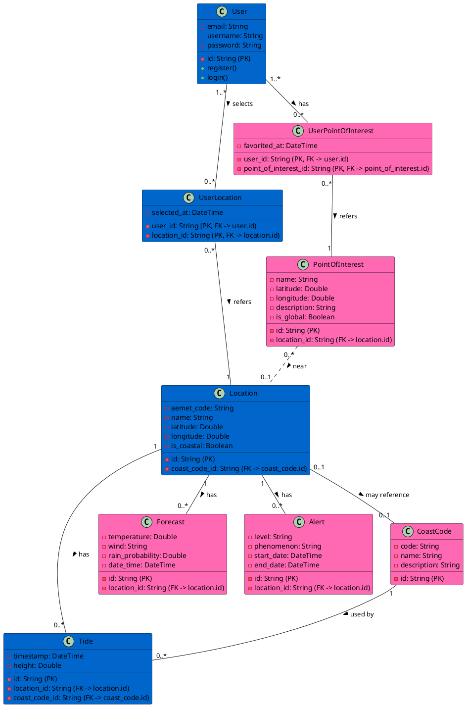
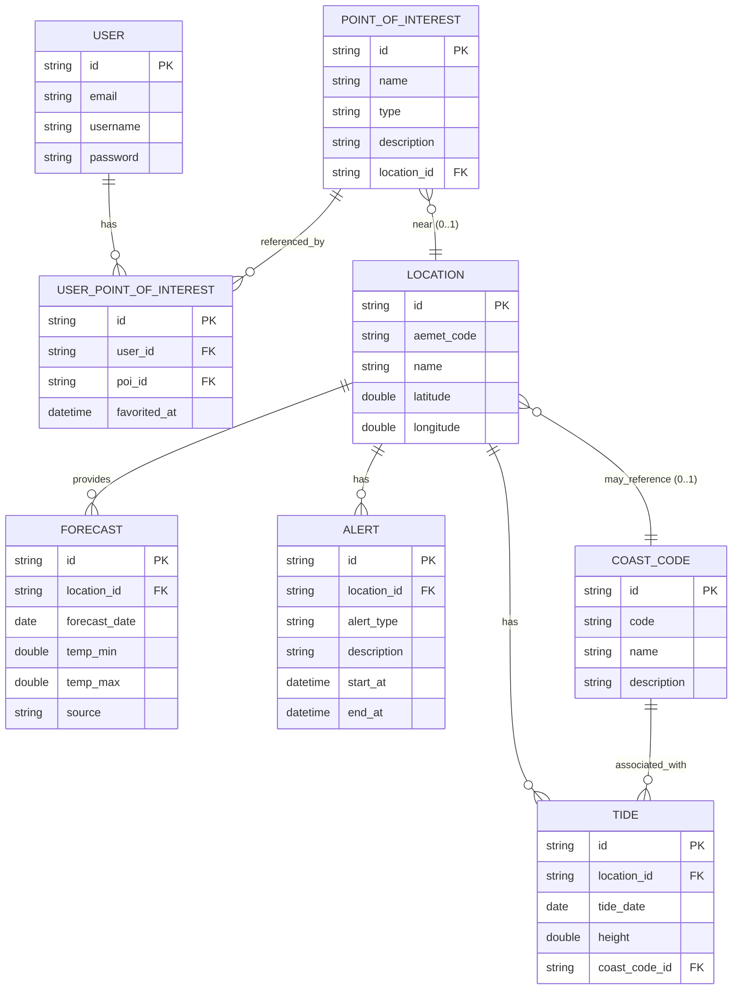

# Diagrams

### Use case diagram

```plantuml
@startuml Use Case Diagram
left to right direction

actor User as U
actor Administrator as A

rectangle "Meteo Canary Islands App" {

  ' Standard User use cases
  usecase "Add Personal Point of Interest" as UC1

  ' Administrator use cases for global POIs
  usecase "Manage Global Points of Interest" as UC1A

  usecase "View Weather Forecast (AEMET)" as UC2
  usecase "View Weather Alerts (Canary Islands)" as UC3
  usecase "View Tides Information" as UC4
  usecase "Logs in/Signs up" as UC5
}

' User relations
U --> UC1
U --> UC2
U --> UC3
U --> UC4
U --> UC5

' Admin relations
A --> UC1A
A --> UC5

@enduml
```

### Class diagram

```plantuml
@startuml Class Diagram

' Rosa = Gabriel, Azul = Angelo

class User #0066CC {
    -id: String (PK)
    -email: String
    -username: String
    -password: String
    +register()
    +login()
}

class Location #0066CC {
    -id: String (PK)
    -aemet_code: String
    -name: String
    -latitude: Double
    -longitude: Double
    -is_coastal: Boolean
    -coast_code_id: String (FK -> coast_code.id)
}

class UserLocation #0066CC {
    -user_id: String (PK, FK -> user.id)
    -location_id: String (PK, FK -> location.id)
    -selected_at: DateTime
}

class Tide #0066CC {
    -id: String (PK)
    -timestamp: DateTime
    -height: Double
    -location_id: String (FK -> location.id)
    -coast_code_id: String (FK -> coast_code.id)
}

class PointOfInterest #FF69B4 {
    -id: String (PK)
    -name: String
    -latitude: Double
    -longitude: Double
    -description: String
    -is_global: Boolean
    -location_id: String (FK -> location.id)
}

class Forecast #FF69B4 {
    -id: String (PK)
    -temperature: Double
    -wind: String
    -rain_probability: Double
    -date_time: DateTime
    -location_id: String (FK -> location.id)
}

class Alert #FF69B4 {
    -id: String (PK)
    -level: String
    -phenomenon: String
    -start_date: DateTime
    -end_date: DateTime
    -location_id: String (FK -> location.id)
}

class CoastCode #FF69B4 {
    -id: String (PK)
    -code: String
    -name: String
    -description: String
}

class UserPointOfInterest #FF69B4 {
    -user_id: String (PK, FK -> user.id)
    -point_of_interest_id: String (PK, FK -> point_of_interest.id)
    -favorited_at: DateTime
}

' User relationships
User "1..*" -- "0..*" UserLocation : selects >
UserLocation "0..*" -- "1" Location : refers >

User "1..*" -- "0..*" UserPointOfInterest : has >
UserPointOfInterest "0..*" -- "1" PointOfInterest : refers >

' AEMET data linked with location
Location "1" -- "0..*" Forecast : has >
Location "1" -- "0..*" Alert : has >
Location "1" -- "0..*" Tide : has >

' Relations for coast codes
CoastCode "1" -- "0..*" Tide : used by >
Location "0..1" -- "0..1" CoastCode : may reference >

' POIs can optionally be linked to a location
PointOfInterest "0..*" .. "0..1" Location : near >

@enduml
```

### Entity relantionship diagram

```mermaid
erDiagram
    %% Entities and attributes (PK = primary key)
    USER {
        string id PK
        string email
        string username
        string password
    }

    LOCATION {
        string id PK
        string aemet_code
        string name
        double latitude
        double longitude
    }

    POINT_OF_INTEREST {
        string id PK
        string name
        string type
        string description
        string location_id FK
    }

    USER_POINT_OF_INTEREST {
        string id PK
        string user_id FK
        string poi_id FK
        datetime favorited_at
    }

    FORECAST {
        string id PK
        string location_id FK
        date forecast_date
        double temp_min
        double temp_max
        string source
    }

    ALERT {
        string id PK
        string location_id FK
        string alert_type
        string description
        datetime start_at
        datetime end_at
    }

    TIDE {
        string id PK
        string location_id FK
        date tide_date
        double height
        string coast_code_id FK
    }

    COAST_CODE {
        string id PK
        string code
        string name
        string description
    }

    %% Relationships (text labels approximate original cardinalities)
    USER ||--o{ USER_POINT_OF_INTEREST : "has"
    POINT_OF_INTEREST ||--o{ USER_POINT_OF_INTEREST : "referenced_by"

    POINT_OF_INTEREST }o--|| LOCATION : "near (0..1)"
    LOCATION ||--o{ FORECAST : "provides"
    LOCATION ||--o{ ALERT : "has"
    LOCATION ||--o{ TIDE : "has"

    COAST_CODE ||--o{ TIDE : "associated_with"
    LOCATION }o--|| COAST_CODE : "may_reference (0..1)"
```
